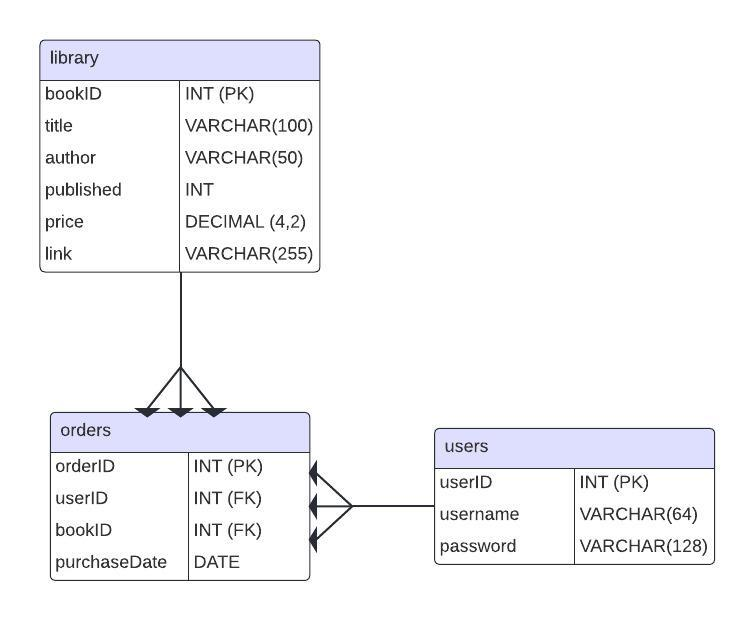

# E-Book App

## Overview

The E-Book App is a user-friendly platform designed for book enthusiasts to browse, purchase, and manage their digital book collections. This application serves as a personal project aimed at honing my skills in software development. Users can create accounts, browse library catalog, view detailed information, and place orders seamlessly. The app is built on a structured database that efficiently stores user credentials, book information, and order history.

## Features

- **User Registration and Authentication**:
  - Secure user accounts with username and hashed password storage.
- **Library Management**:
  - A comprehensive collection of books with details including title, author, publication year, price, and direct links for access.
- **Order Placement**:
  - Users can purchase books, with order details recorded for future reference.
- **Data Security**:
  - Passwords are stored using SHA-256 hashing, ensuring that the application never stores actual passwords. During login, the entered password is hashed and compared to the stored hash for verification, enhancing security against data breaches.
- **User Account Management**:
  - Users can change their username and password securely. The application prompts for confirmation before making any changes, ensuring that accidental alterations are minimized. After confirming the change, users receive feedback on the status of their request (e.g., "Username Changed" or "Password Changed").
- **Account Deletion**:
  - Users have the ability to delete their accounts through a simple confirmation process. Once the deletion is confirmed, the account is permanently removed from the database, and users are notified of the successful action with a message stating "Account Deleted". This feature enhances user control over their data within the application.

## Technologies Used

- **Database**: MySQL for storing user, book, and order data.
- **Programming Language**: Java for backend logic and application functionality.
- **Framework**: JFRAME for the app's user interface and experience.

## Getting Started

To get started with the E-Book App, follow these steps:

1. **Clone the Repository**

   - Download the project files from the repository.

2. **Set Up the Database:**

   - Import the provided MySQL scripts into your database management system to create the necessary tables and populate them with sample data.
   - For more step by step instructions follow this link: https://www.youtube.com/watch?v=u96rVINbAUI&ab_channel=WebDevSimplified (WorkBench not required)

3. **Configure Database Connection:**

   - Update the database connection settings in the application configuration file to match your local setup.

4. **Run the Application:**

   - Run the mysql_query.sql on the active connection on the database.
   - Use your IDE or command line to run the application(AppMain.java). Maven will handle the build process automatically.

5. **Access the App:**
   - Use one of the sample user data or create your own account to log in and browse the application.

